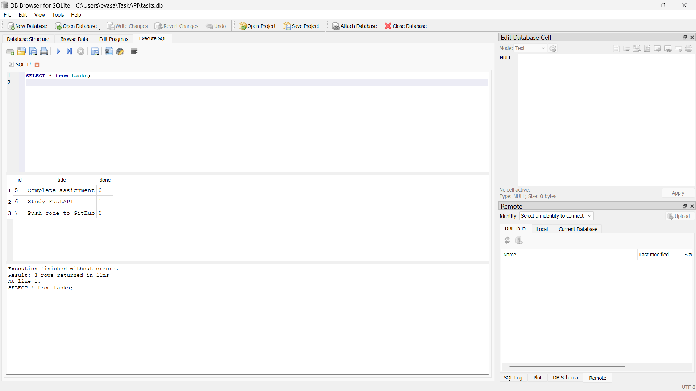

# Task API

A simple RESTful CRUD API built with **FastAPI** for managing tasks with **SQLite persistent storage**.

The project was initially implemented using an in-memory Python list and was later migrated to SQLite to provide persistent data storage.

---

## Features

- Create a task
- View all tasks
- View a task by ID
- Update a task
- Delete a task
- Filter tasks by completion status
- Search tasks by title
- View task statistics
- SQLite persistent storage
- Automatic database initialization
- Interactive Swagger UI documentation
- Custom request validation and error responses
- Data persistence across server restarts

---

## Tech Stack

- Python 3
- FastAPI
- Uvicorn
- Pydantic
- SQLite
- SQL

---

## Installation

### Clone the repository

```bash
git clone https://github.com/Ayshashafeek/TaskAPI.git
cd TaskAPI
```

### Create a virtual environment

```bash
python -m venv venv
```

### Activate the virtual environment

#### Windows

```bash
venv\Scripts\activate
```

### Install dependencies

```bash
pip install fastapi uvicorn
```

---

## Run the Application

Start the FastAPI server using:

```bash
uvicorn main:app --reload
```

The API will be available at:

```text
http://127.0.0.1:8000
```

### Swagger UI

Interactive API documentation is available at:

```text
http://127.0.0.1:8000/docs
```

Swagger UI can be used to test all API endpoints directly from the browser.

---

# API Endpoints

| Method | Endpoint | Description |
|---|---|---|
| GET | `/` | API information |
| GET | `/health` | Health check |
| GET | `/tasks` | Get all tasks |
| GET | `/tasks/{id}` | Get a task by ID |
| POST | `/tasks` | Create a new task |
| PUT | `/tasks/{id}` | Update a task |
| DELETE | `/tasks/{id}` | Delete a task |
| GET | `/tasks?done=true` | Filter completed tasks |
| GET | `/tasks?done=false` | Filter incomplete tasks |
| GET | `/tasks?search=FastAPI` | Search tasks by title |
| GET | `/stats` | Get task statistics |

---

# Example Requests and Responses

## Get All Tasks

### Request

```bash
curl -i http://127.0.0.1:8000/tasks
```

### Example Response

```json
[
  {
    "id": 1,
    "title": "Complete assignment",
    "done": false
  },
  {
    "id": 2,
    "title": "Study FastAPI",
    "done": true
  },
  {
    "id": 3,
    "title": "Push code to GitHub",
    "done": false
  }
]
```

---

## Get a Task by ID

### Request

```bash
curl -i http://127.0.0.1:8000/tasks/1
```

### Example Response

```json
{
  "id": 1,
  "title": "Complete assignment",
  "done": false
}
```

If the task does not exist:

```json
{
  "error": "Task 99 not found"
}
```

The API returns HTTP `404`.

---

## Create a Task

### Request

```bash
curl -X POST http://127.0.0.1:8000/tasks ^
-H "Content-Type: application/json" ^
-d "{\"title\":\"Learn SQLite\"}"
```

### Example Response

```json
{
  "id": 4,
  "title": "Learn SQLite",
  "done": false
}
```

---

## Update a Task

### Request

```bash
curl -X PUT http://127.0.0.1:8000/tasks/1 ^
-H "Content-Type: application/json" ^
-d "{\"title\":\"Finish SQLite assignment\",\"done\":true}"
```

### Example Response

```json
{
  "id": 1,
  "title": "Finish SQLite assignment",
  "done": true
}
```

The update operation can modify the title, completion status, or both.

---

## Delete a Task

### Request

```bash
curl -X DELETE http://127.0.0.1:8000/tasks/1
```

The API returns:

```text
204 No Content
```

If the task does not exist:

```json
{
  "error": "Task 1 not found"
}
```

The API returns HTTP `404`.

---

# Filtering and Searching

## Filter by Completion Status

Completed tasks:

```bash
curl "http://127.0.0.1:8000/tasks?done=true"
```

Incomplete tasks:

```bash
curl "http://127.0.0.1:8000/tasks?done=false"
```

The filtering is performed using SQL conditions.

---

## Search by Title

Example:

```bash
curl "http://127.0.0.1:8000/tasks?search=FastAPI"
```

The API searches for the specified text within task titles.

---

## Combine Filtering and Search

Example:

```bash
curl "http://127.0.0.1:8000/tasks?done=false&search=assignment"
```

This returns tasks that are incomplete and whose title contains the specified search text.

---

# Task Statistics

The `/stats` endpoint provides the total number of tasks, completed tasks, and open tasks.

### Request

```bash
curl http://127.0.0.1:8000/stats
```

### Example Response

```json
{
  "total": 3,
  "done": 1,
  "open": 2
}
```

The statistics are calculated using SQL `COUNT()` queries.

---

# SQLite Database

The Task API uses **SQLite** for persistent task storage.

The database file is:

```text
tasks.db
```

The database is initialized automatically when the application starts.

If the `tasks` table does not exist, it is created automatically.

If the table exists but contains no tasks, the application inserts the initial sample tasks.

This allows the application to start with sample data while maintaining persistent storage.

---

## Database Schema

The database contains a `tasks` table with the following columns:

| Column | Type | Description |
|---|---|---|
| `id` | INTEGER | Primary key with auto-increment |
| `title` | TEXT | Task title |
| `done` | BOOLEAN | Task completion status |

SQLite internally stores Boolean values as:

```text
0 = false
1 = true
```

The API converts these values back to Python Boolean values when returning responses.

---

# SQL Queries Tested

The following SQL queries were manually executed using **DB Browser for SQLite**.

## 1. View All Tasks

```sql
SELECT * FROM tasks;
```

---

## 2. View Completed Tasks

```sql
SELECT * FROM tasks WHERE done = 1;
```

---

## 3. Count All Tasks

```sql
SELECT COUNT(*) FROM tasks;
```

---

## 4. Mark All Tasks as Completed

```sql
UPDATE tasks SET done = 1;
```

After executing the update, the database was checked again using:

```sql
SELECT * FROM tasks;
```

All tasks were shown with `done = 1`.

---

## 5. Delete Completed Tasks

```sql
DELETE FROM tasks WHERE done = 1;
```

After executing the query, the database was checked using:

```sql
SELECT * FROM tasks;
```

The table was empty.

The FastAPI application was then restarted. Since the database initialization checks whether the table is empty, the initial sample tasks were inserted again.

---

# Persistence

The application uses SQLite instead of an in-memory Python list.

Therefore, tasks created through the API are stored in:

```text
tasks.db
```

and remain available after restarting the FastAPI server.

Example:

```text
POST /tasks
      ↓
SQLite database
      ↓
Server restart
      ↓
GET /tasks
      ↓
Task still exists
```

This demonstrates persistent storage.

---

# Validation and Error Handling

The API validates incoming request data and returns appropriate HTTP status codes.

## Missing or Empty Title

Example:

```json
{
  "title": ""
}
```

Response:

```json
{
  "error": "Title is required"
}
```

Status:

```text
400 Bad Request
```

---

## Empty Update Request

Example:

```json
{}
```

Response:

```json
{
  "error": "Request body cannot be empty"
}
```

Status:

```text
400 Bad Request
```

---

## Non-existent Task

Example:

```text
GET /tasks/999
```

Response:

```json
{
  "error": "Task 999 not found"
}
```

Status:

```text
404 Not Found
```

---

# Swagger UI

Interactive API documentation is available at:

```text
http://127.0.0.1:8000/docs
```

Swagger UI allows all API endpoints to be tested directly from the browser.

## Screenshots

### Swagger UI


### Create Task


### Get Tasks


### SQLite Database



---

# Project Structure

```text
TaskAPI/
├── main.py
├── database.py
├── README.md
├── .gitignore
├── docs/
│   ├── png1.png
│   ├── png2.png
│   ├── png4.png
│   └── png5.png
└── ai-version/
    └── main.py
```

The following local files and directories are excluded from Git:

```text
venv/
__pycache__/
*.pyc
tasks.db
*.sqbpro
```

---

# Git Commit Stages

The project was developed incrementally using Git commits.

## Stage 0

```text
Stage 0: create SQLite database
```

Created the SQLite database and database initialization logic.

## Stage 1

```text
Stage 1: database read endpoints
```

Migrated:

```text
GET /tasks
GET /tasks/{id}
```

to SQLite.

## Stage 2

```text
Stage 2: insert into database
```

Migrated:

```text
POST /tasks
```

to SQLite.

## Stage 3

```text
Stage 3: update and delete with SQL
```

Migrated:

```text
PUT /tasks/{id}
DELETE /tasks/{id}
```

to SQLite.

## Stage 4

```text
Stage 4: explored SQLite
```

Manually executed SQL queries using a SQLite database viewer and added SQL-based task statistics.

---

# AI vs Me

For the AI comparison stage, I asked an AI assistant to independently build the same Task API based on my own specification. The generated implementation was kept separate from the hand-built implementation.

## My Original Prompt

> Build a REST API for managing tasks using Python and FastAPI. Store the tasks in memory using a Python list, without a database. I need endpoints for creating, reading, updating, and deleting tasks. The API should validate request bodies, return appropriate HTTP status codes, handle missing task IDs, and expose Swagger documentation. Make the API runnable with Uvicorn.

The AI-generated version was tested separately using Swagger UI and compared with my hand-built implementation.

---

## Differences I Found

### 1. Task Structure

My implementation uses:

```json
{
  "id": 1,
  "title": "Study FastAPI",
  "done": true
}
```

The AI implementation used:

```json
{
  "id": 1,
  "title": "aysh",
  "description": "a girl",
  "completed": false
}
```

The AI added a `description` field and used `completed` instead of `done`.

**Reason:** My prompt did not explicitly specify the exact task schema, so the AI made its own design decision.

---

### 2. Extra PATCH Endpoint

My API requires:

```text
PUT /tasks/{id}
```

for updating tasks.

The AI implementation provided both:

```text
PUT /tasks/{task_id}
PATCH /tasks/{task_id}
```

PATCH was not required.

**Reason:** My prompt requested CRUD and an update operation but did not explicitly say that PUT must be the only update endpoint.

---

### 3. Error Response Format

My implementation returns a custom response for an unknown task:

```json
{
  "error": "Task 99 not found"
}
```

The AI implementation returned:

```json
{
  "detail": "Task not found"
}
```

The structure and message were different.

**Reason:** My prompt requested appropriate error handling but did not specify the exact JSON error format.

---

### 4. Validation Behavior

My implementation converts FastAPI request validation errors into HTTP `400` responses.

The AI-generated Swagger documentation showed FastAPI's default:

```text
422 Validation Error
```

**Reason:** My original prompt did not explicitly state that validation errors must return `400` instead of FastAPI's default `422`.

---

## What Did the AI Do Better?

The AI used separate Pydantic models such as `Task`, `TaskCreate`, and `TaskUpdate`, which made the API structure clear and strongly typed.

Its generated Swagger documentation also clearly exposed the request and response schemas.

I could understand and explain these choices because I had already built the same API manually.

---

## What Did the AI Get Wrong?

The AI changed the task data model, added an unnecessary PATCH endpoint, and did not follow my intended custom error and validation behavior.

These differences did not necessarily make the AI implementation unusable, but they made it different from the API I intended to build.

---

## What Did My Prompt Forget?

My original prompt was too general. I did not specify:

- The exact task fields: `id`, `title`, and `done`
- That `description` should not exist
- That `PUT` should be the update endpoint
- That PATCH should not be added
- That invalid request bodies should return `400`
- The exact JSON structure for `404` errors
- The exact response behavior for `DELETE`

The AI silently made decisions about these unspecified details.

---

## Rematch

After reviewing the first AI implementation, I improved my specification by explicitly defining the task schema, update behavior, validation status codes, error response format, and DELETE behavior.

The improved prompt produced a version that was closer to my original implementation because the requirements were more precise.

---

# Author

**Aysha Shafeek M M**