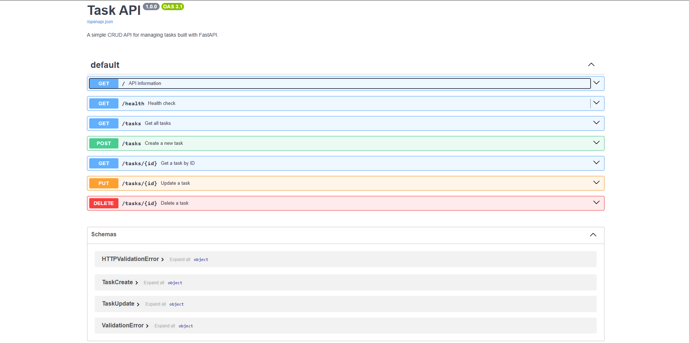
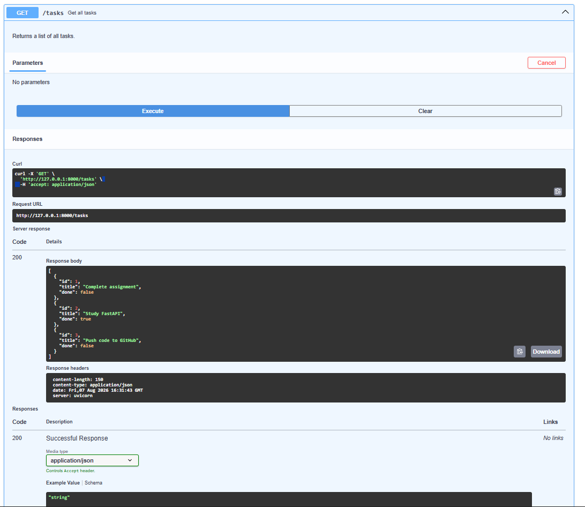
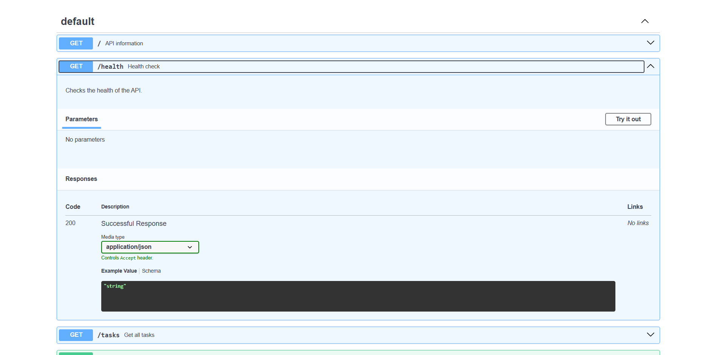

# Task API

A simple RESTful CRUD API built with **FastAPI** for managing tasks.

## Features

- Create a task
- View all tasks
- View a task by ID
- Update a task
- Delete a task
- Interactive Swagger UI documentation

---

## Tech Stack

- Python 3
- FastAPI
- Uvicorn
- Pydantic

---

## Installation

### Clone the repository

```bash
git clone https://github.com/Ayshashafeek/TaskAPI.git
cd TaskAPI
```

### Create a virtual environment

```bash
python -m venv venv
```

### Activate the virtual environment

**Windows**

```bash
venv\Scripts\activate
```

### Install dependencies

```bash
pip install fastapi uvicorn
```

---

## Run the application

```bash
uvicorn main:app --reload
```

The API will be available at:

```
http://127.0.0.1:8000
```

Swagger UI:

```
http://127.0.0.1:8000/docs
```

---

## API Endpoints

| Method | Endpoint | Description |
|--------|----------|-------------|
| GET | / | API information |
| GET | /health | Health check |
| GET | /tasks | Get all tasks |
| GET | /tasks/{id} | Get task by ID |
| POST | /tasks | Create a task |
| PUT | /tasks/{id} | Update a task |
| DELETE | /tasks/{id} | Delete a task |
| GET | /tasks?done=true | Filter tasks by completion status |
| GET | /tasks?search=FastAPI | Search tasks by title |
| GET | /stats | Get task statistics |

---

## Example curl

```bash
curl -i http://127.0.0.1:8000/tasks
```

Example output

```http
HTTP/1.1 200 OK
content-type: application/json

[
  {
    "id":1,
    "title":"Complete assignment",
    "done":false
  },
  {
    "id":2,
    "title":"Study FastAPI",
    "done":true
  }
]
```

---

## Swagger UI

Open:

```
http://127.0.0.1:8000/docs
```

## Screenshots

### Swagger UI


### Create Task


### Get Tasks

```markdown

```
## Persistence Experiment

- Tasks created through the API disappear when the server is restarted. This happens because the current Task API stores tasks only in an in-memory Python list rather than a persistent database. The data therefore exists only while the application process is running.
---

- Filter tasks by completion status
- Search tasks by title
- View task statistics

## Author

Aysha Shafeek M M

